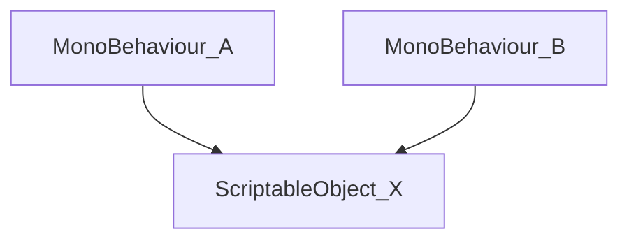

# Simple Atom for Unity

## Introduction

We can use Unity ScriptableObjects (SOs) to store data in a game project, following a Data Driven architecture. Thus, a MonoBehaviour script A do not need depend on another MonoBehaviour B. They can use the data that are stored in a SO X. On the Unity Editor, all scripts that need any information stored in X, can reference this using a property and can be configured already in a prefab.




## How to work Simple Atom (SA) lib

The Simple Atom (SA) is divided in 3 types of classes: variables, events, listeners. The listeners are subdivided in two subtypes: variable listeners and event listeners.

### Variables

We create the main variable types used in Unity, but you can create all others types that you need. Variables are Scriptable Objects. We create the types:
- IntVariable
- FloatVariable
- BoolVariable
- StringVariable
- GameObjectVariable

They inherit from BaseVariable class. Below how the IntVariable is defined:
```csharp
[CreateAssetMenu(menuName = "SimpleAtoms/Variables/Int")]
public class IntVariable : BaseVariable<int>
{
}
```

To create a custom Variable Class, you need follow the steps
- the custom class needs to intherit from BaseVariable and change the type between <type> to its own type.
- the menuName must be changed

So, the Custom class will be thus:
```csharp
[CreateAssetMenu(menuName = "SimpleAtoms/Variables/Custom")]
public class CustomVariable : BaseVariable<Custom>
{
}
```

### Events
We also create the main events types used in Unity, adding the void type. Events are Scriptable Objects.
- IntEvent
- FloatEvent
- BoolEvent
- StringEvent
- GameObjectEvent
- VoidEvent (specific case when none value is need to be fired)

You can create a Custom Event class thus:
```csharp
[CreateAssetMenu(menuName = "SimpleAtoms/Events/Custom")]
public class CustomEvent : BaseEvent<Custom>
{
}
```

### Listeners
There are two types of listeners: Variable Listeners and Event Listeners. Listeners are MonoBehaviours classes.

#### Event Listener
Event Listeners are components that listen for a Event. You can create a FloatEventListener to listen for a FloatEvent. In other words, when the FloatEvent is fired, the FloatEventListener listen for this event and fire its response (Unity Event).

You can create a Event Listener thus:
```csharp
[AddComponentMenu("Simple Atoms/Listener/Events/Custom")]
public class CustomEventListener : BaseEventListener<Custom>
{
}
```

#### Variable Listener
Variable Listeners are components that listen for a event via a Variable. In other words, when the value of a Variable changes the listener fire its response (Unity Event). This component can to force a event to occurs initialization (forceEventOnRegister property).

You can create a Variable Listener thus:
```csharp
[AddComponentMenu("Simple Atoms/Listener/Variables/Custom")]
public class CustomVariableListener : BaseVariableListener<Custom>
{
}
```

## Examples
In the Simple Atom project, there are examples in the scene folder:
- Example 1 - Float Listeners
- Example 2 - Void Listener 

## A complete implementation of Atoms
If you need a complete implementation of Atoms with many use cases, then you can use the Unity Atoms.

[Unity Atoms](https://unity-atoms.github.io/unity-atoms/)

## References
- [How to make your code more Modular using Scriptable Objects in Unity](https://www.youtube.com/watch?v=6deqAk3jypo)
- [Three ways to architect your game with ScriptableObjects](https://unity.com/how-to/architect-game-code-scriptable-objects)